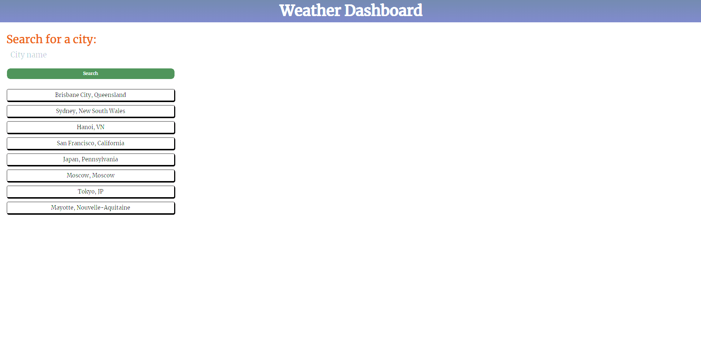
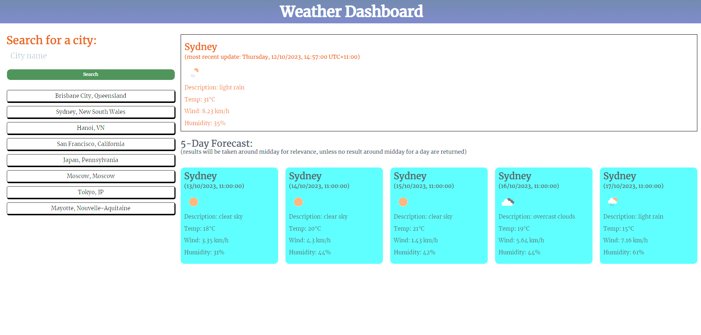

# Weather forecast
(You can access our deployed website here: https://honguyen00.github.io/weather-forecast/)

## Description

The aim of this project is to build a search engine that can search for any cities in the world and display the current weather as well as a simple 5-day weather forecast of that searched city with the use of OpenWeatherAPI.

## Installation

N/A

## Usage
This is the overall look of the website  

You can search for a new city or revert back to a previously searched city by clicking on a history result.

Once you have chosen your city, its current weather and weather forecast will be displayed

